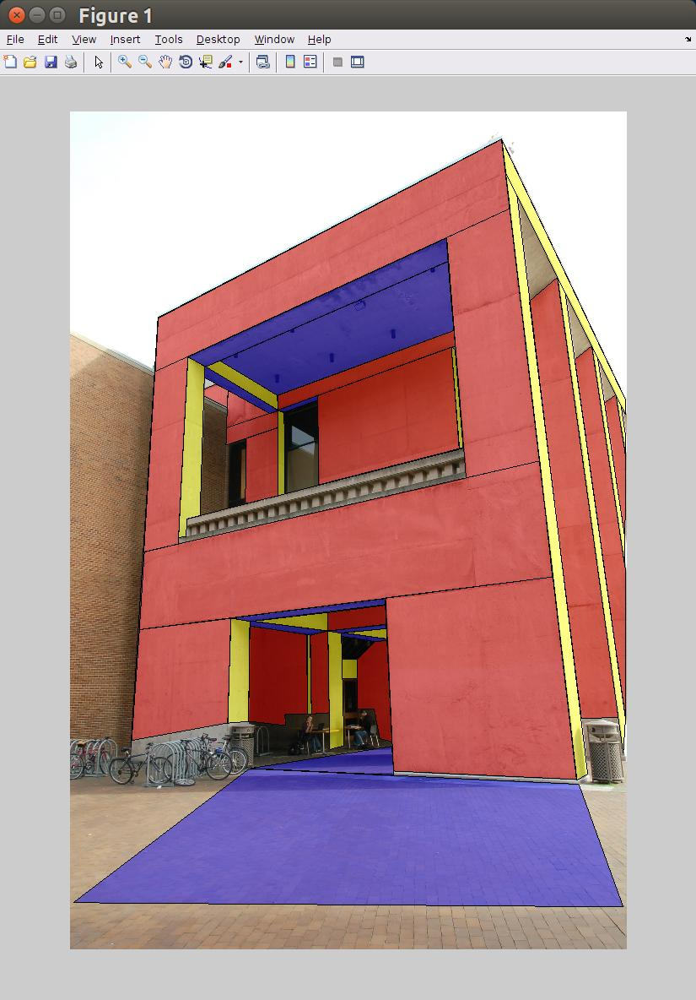

# Goal

This repository provides Matlab code to load the content of an SVG file into a simple Matlab structure (*loadSVG.m*), to save a Matlab structure containing polygons and images into a SVG file (*saveSVG.m*) and a function to dislay this structure in a Matlab figure (*plotSVG.m*). It is possible to edit the polygons interactively within a matlab figure using plotSVG with the *true* as the second argument. 

# License

Free BSD.

# Limitations

This code does not handle bezier curves yet. We could reuse code from http://uk.mathworks.com/matlabcentral/fileexchange/31453-bezier-curve-plotter-gui

We could create a small matlab gui to modify a svg structure by dragging the points, deleting polygons and creating new polygons.


# Examples

```
#!matlab


 		>> svg=loadSVG('building.svg');
 		>> svg

		svg = 

		    images: {[1x1 struct]}
		    layers: {[1x1 struct]  [1x1 struct]  [1x1 struct]  [1x1 struct]}

 		>> svg.images{1}

		ans = 

			 x: '0'
			 y: '0'
		     width: 2000
		    height: 3008
		      file: 'building.jpg'

 		>> svg.layers{1}

		ans = 

			    polys: {6x1 cell}
			   colors: [4x6 double]
			   svgids: {6x1 cell}
			     name: 'vanishing_points'
		    stroke_colors: [4x6 double]

 		>> svg.layers{3}.polys{4}		 

		ans =

		   1.0e+03 *

		    0.4248    0.4850    0.4682    0.4199    0.4189    0.3910
		    0.8818    0.9144    1.4517    1.4644    1.5265    1.5298

 		>> edit=true 
 		>> plotSVG(svg,edit) % setting edit to true enables the interactive edition of the vertex positions
 		>> saveSVG('building2.svg')
```

matlab screenshot

